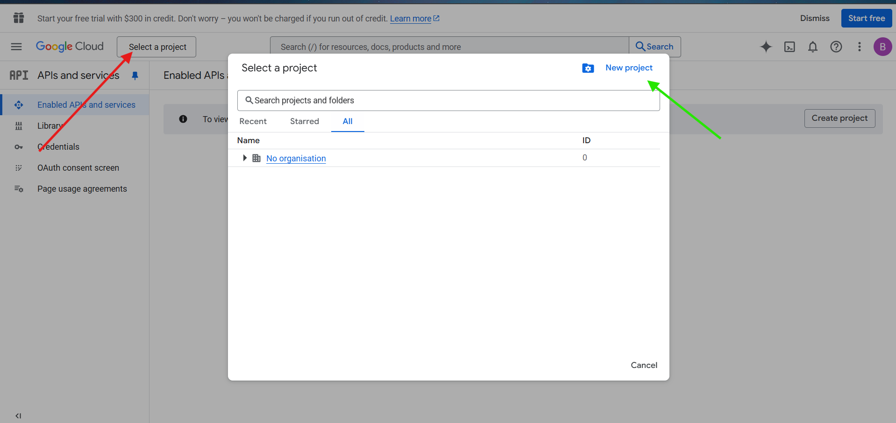
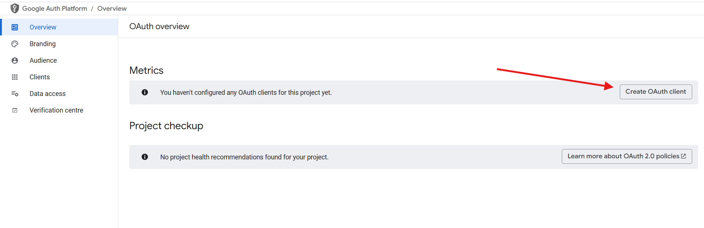
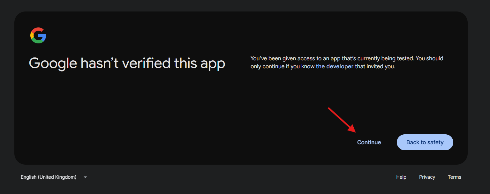

# Admin-Dashboard

# Google Meet Setup Documentation

### Step-1: Open Google Developer Console
 - Open any web browser (Chrome is recommended, but any browser will work).
- In the search bar, type "Google Developer Console".
- Click on the official link: https://console.developers.google.com/
 - 

### Step 2: Register Your Email
- You will be redirected to the Google Developer Console landing page.
- A pop-up will appear asking you to register your email.
- **Please register using the email address you intend to use for the Calendar service.**

### Step 3: Create a New Project
- Click on the “Select a project” dropdown located in the top-left corner of the dashboard.
- In the pop-up window, click on the “New Project” button located at the top-right corner.
 - 

### Step 4: Name Your Project
- Enter a project name (for example: XYZ Admin Dashboard).
- Leave the Location as default — it should show No organization.
- Click on the “Create” button to proceed.
- 

### Step 5: Enable APIs and Services
- After creating the project, you’ll be redirected to the APIs & Services dashboard.
- Click on the **“+ ENABLE APIS AND SERVICES”** button located at the top center of the page.
- You’ll be redirected to the Google API Library.
- In the search bar, type “Calendar”, then select Google Calendar API and click Enable.
- After enabling, you'll be redirected to the API/Service details page, where you can monitor your API usage and performance.
- Now, click on “Back to APIs & Services” to return to the main dashboard.
- Repeat the same steps: search for “Google Meet REST API”, select it, and click Enable.
- 
- 
- 
- 

### Step 6: Configure OAuth Consent Screen
- From the left-hand side menu, click on OAuth consent screen.
- Click the “Get Started” button that appears.
- Now, fill in your App Information:
  - Enter your App name.
  - Select the User support email (use the same email that will be used for API services).
- Click Next.
- On the User Type (Audience) screen, choose External and click Next.
- Enter your Contact email address.
- Click Next, then Agree, and finally click Create.
- 
- 
- 
- 
- 
- 

### Step 7: Set Up OAuth Client
- Click on the “Create OAuth Client” button at the top right corner of the page.
- Select **Web application** as the application type.
- Give your application a meaningful name (e.g., Sankhyana App).
- Scroll down to the Authorized redirect URIs section and enter the following URL: https://suits.sankhyana.com
- Click Create
-  **A pop-up will appear containing your Client ID and Client Secret—these credentials are required to integrate Google APIs with your application.**
- Click Download JSON to securely save the credentials file.
- Store this JSON file in a safe location on your system or cloud drive for future use.
- 
- 
- 

### Step-8: Add Tester for Google Verification
- After successfully creating the OAuth client, you will be on the Google Auth Platform / Client page.
- Now, click on the “Audience” option from the left sidebar.
- You will be redirected to the Audience page. Scroll down to the OAuth User Cap section.
- Under that section, click on the “Add User” button located below the Test Users option.
- A right-side panel will slide in. In the input field, enter the email address you want to use for testing — this should be the same email you provided earlier for API access.
- After adding the email, click Save.
- 
- 
- 

### Step 9: Provide Client ID and Secret in the Website
- Go to the official website and log in.

- From the left sidebar, select the Settings option.

- Under Organization Settings, click on **Google Meet**.

- In the form, provide the **Client ID** and **Client Secret** that match the credentials from your downloaded JSON file.

- Click on the Save button.

- **Once saved**:

  - You will be redirected to a new window.

  - Click on "Click to Authenticate".

  - You will be redirected to the Google Authentication page.

  - Select the Google account that you used while creating the    project in the Google Developer Console.

  - Click Continue twice.

  - If you are redirected to a page that says "Successfully Authenticated", your organization is now ready to use the Meet service.

- **🚫 If you encounter an error on the authentication page:**

  - Double-check that your Client ID and Client Secret are correct.

  - Ensure they match the credentials from the Developer Console.

  - If everything seems fine, wait a few moments and try again.
- 
- 
- 
- 
- 
- 
- 